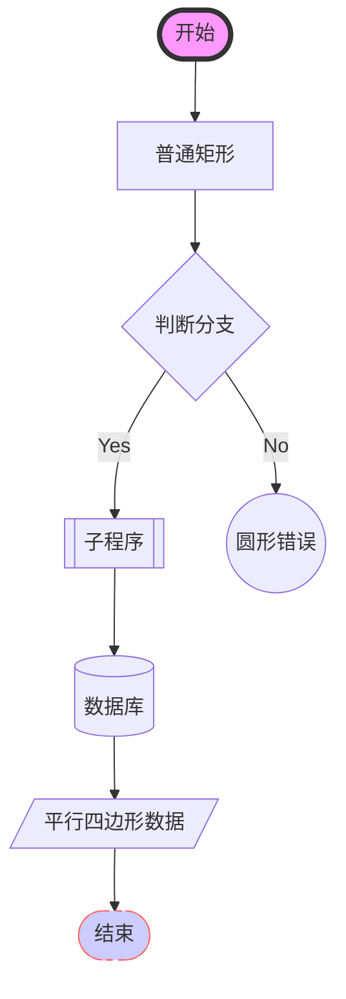
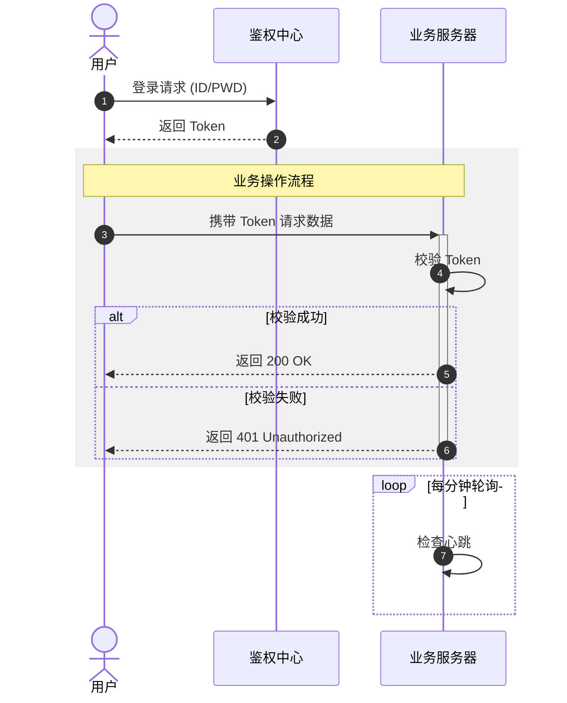
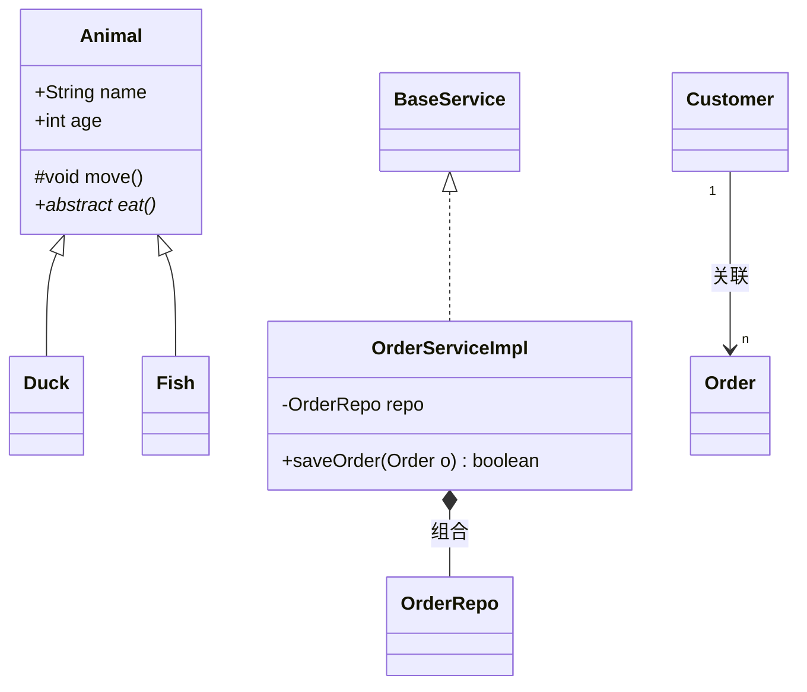
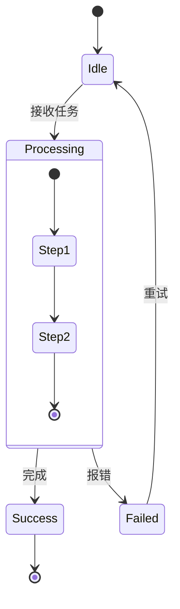
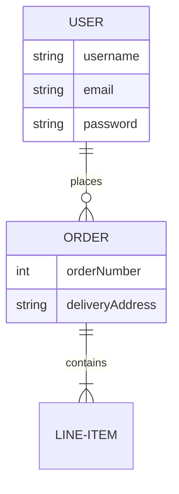

Mermaid 的语法非常丰富，它不仅仅能画流程图。为了让你在 IDEA 的 Markdown 预览中达到最佳效果，我按**功能模块**为你整理了 Mermaid 的全语法示例。

你可以直接将这些代码块复制到 IDEA 的 Markdown 文件中测试。

---

### 1. 流程图 (Flowcharts)
支持多种方向（TB, BT, LR, RL）和丰富的形状。



---

### 2. 时序图 (Sequence Diagrams)
这是开发中使用频率最高的部分，支持逻辑判断和循环。



---

### 3. 类图 (Class Diagrams)
对 Java 开发者最友好，支持成员变量、方法和继承关系。



---

### 4. 状态图 (State Diagrams)
适合描述复杂的业务生命周期（如订单状态、线程状态）。



---

### 5. 实体关系图 (ER Diagram)
用于描述数据库建模。



---

### 6. 甘特图与用户旅程 (Gantt & User Journey)
用于项目管理和需求分析。

```mermaid
%% 甘特图
gantt
    title 项目开发计划
    dateFormat  YYYY-MM-DD
    section 需求
    调研           :a1, 2026-04-01, 10d
    方案设计        :after a1, 7d
    section 开发
    后端开发        :2026-04-15, 20d
    前端开发        :2026-04-20, 15d

%% 用户旅程
journey
    title 用户购物体验
    section 浏览
      查找商品: 5: 用户
      对比价格: 3: 用户
    section 支付
      填写地址: 4: 用户
      确认支付: 2: 用户, 银行
```

---

### 7. 饼图、心智图与象限图 (Others)
Mermaid 最近更新支持了更多的可视化类型。


---

### IDEA 配合总结：
* **Mermaid 插件**支持以上所有语法。
* 如果你的 IDEA 预览不显示，请检查 `Settings -> Languages & Frameworks -> Markdown` 里的预览引擎是否设为 **JCEF**。
* **技巧**：在时序图中，使用 `+` 和 `-`（如 `User->>+SRV`）可以让侧边的激活条（Activation Bar）自动显示，这能极大地提高图表的可读性。

你打算把哪个类型的图表先集成到你的 `plan.md` 自动化工作流中？